# Bank-management

Hello, this is my new project **Bank-mangement**. I can even say that this is my most complicated project, because I also worked with lists in this project, to be more precise, we worked with our group. We wrote the program together with **@ELMURODSALOMOV** and **@saidjonjalolov**. So let's go back to the project.
## 1 Loyihada listlarning roli

-----------------------------
|
|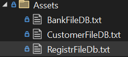|

user data is saved in register file db,

customer file db contains account numbers and balance,

bank file db contains account numbers for the bank.

## 2 Runtime code

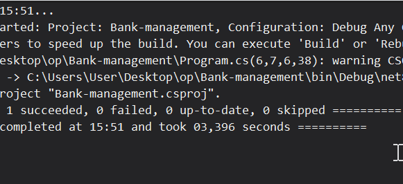

The process of sing up and login is shown here.

because there is no such user in the database where the login password is used, he failed to sign up

## 2.1 Database of client

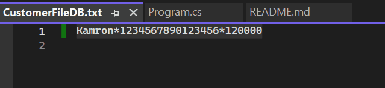

Here you can see the account number.

### 2.1.1 create account number
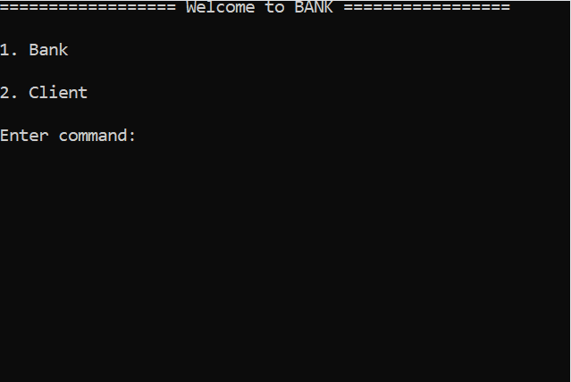

To create an account, you must have the name of the owner, a new number and add balance. The number of numbers is less than 20 digits or cannot be duplicated.

### 2.1.2 transfer money
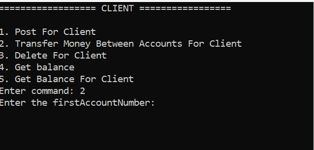

To transfer money from one account to another, first enter the sending account number and then the receiving account number.

### 2.1.3 delete account number
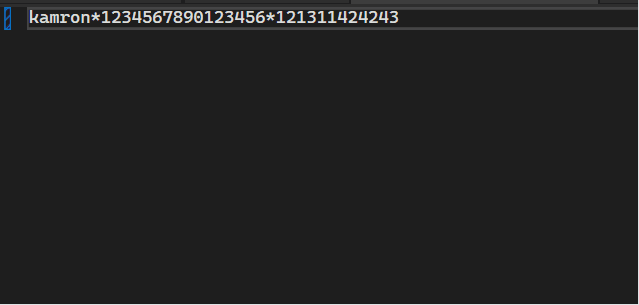

To delete an account number, only the account number is required.

### 2.1.4 get balance from account number
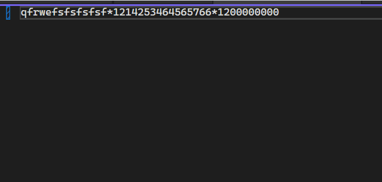

here you do not enter anything, the program itself displays all account numbers.

### 2.1.5 Get balance for client
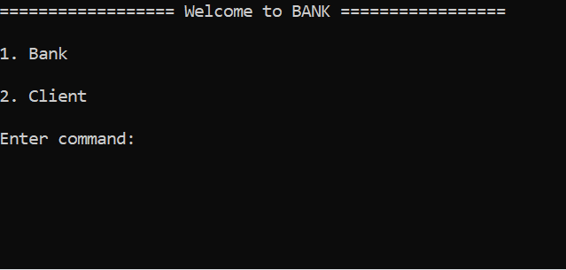

here you enter your nothing account number and it tells you how much money you have.

## 2.2 Database of Bank

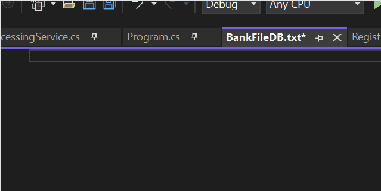

There are no bank accounts here.

### 2.2.1 post deposit
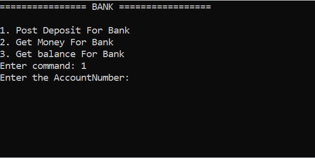

here you enter your account number and write how much money you want to deposit and the computer will add that much money.

### 2.2.2 get money

you enter your account number here and write how much money you want to withdraw.

### 2.2.3 Get balance
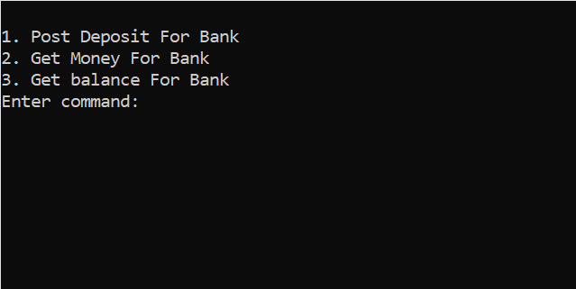

here you enter your account number and the program displays.

# Project helpers

Project by ***@CoderKamron2011***

**Big thanks**
**@ELMURODSALOMOV**
**@saidjonjalolov**
**@AslanbekHasanov**