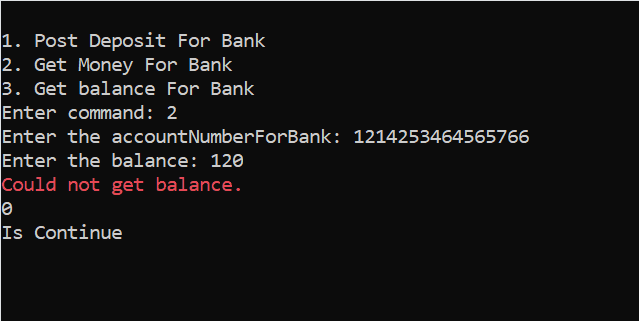

# Bank-management

Salom bu mening yangi loyiham **Bank-mangement**. bu menig eng murakkab loyiham desam ham bo'ladi chunki men bu loyihamda list lar bilan ham ishlaganman to'griroq qilib aytsam guruhimiz bilan ishlaganmiz Programni **@ELMURODSALOMOV** va **@Karimjon0** bilan birga yozganmiz. Hullas loyihaga qaytsak.

## 1 Loyihada listlarning roli

-----------------------------
|
||

register file db da user malumotlari saqalandi,
customer file db da hisob raqamlari va balance joylashgan,
bank file db da esa bank uchun hisob raqamlar joylashgan.

## 2 Runtime code

Bu yerda sing up va login ning ishlash jarayoni korsatlgan.

bu yerda login brinchi ishlatilggan baza da unday user mavjud emasligi uchun u sign up ga utib ketdi

### 2.1 Client methodlari

Bu yerda siz hisob raqamni korishingizz mumkin.

#### 1. create

#### 2. transfer money

#### 3.delete

#### 4.get balance

#### 5.Get balance for client

### 2.2 Bank methodlari

Bu yerda bank uchun hech qanday hisob raqamlar yo'q.

#### 1.post deposit

#### 2.get money

#### 3.Get balance

# Project helpers

Project by ***@CoderKamron2011***

**Big thanks**
**@ELMURODSALOMOV**
**@saidjonjalolov**
**@AslanbekHasanov**